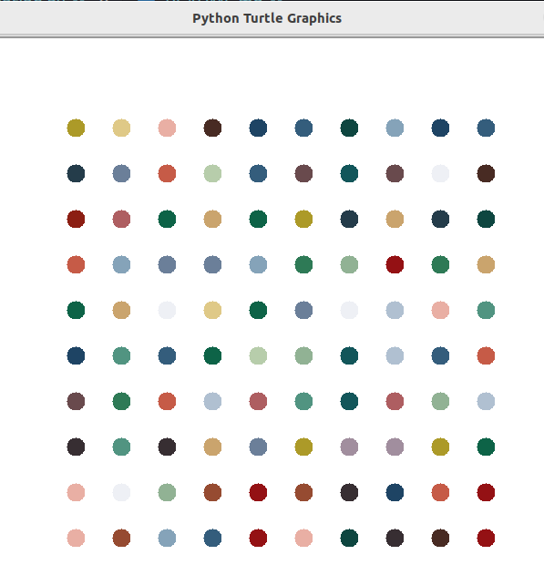

# Hirst Painting 
This is a recreation of [Damien Hirst's] Spot Painting using Python with the help of the Turtle module.


## 📝 Prerequisites
+ Familiar with the [Turtle module](https://docs.python.org/3/library/turtle.html)(Don't know? The Internet is the savior. Trust me it's easy).
+ Installation of the [colorgram Package](https://pypi.org/project/colorgram.py) (We need to make our painting as colorful as Damien Hirst's).
+ Basic comprehension of the [RGB color system](https://en.wikipedia.org/wiki/RGB_color_model).

## ⚙️ Languages or Frameworks Used
You only need Python to run this script. You can visit [here](https://www.python.org/downloads) to download Python.

## 🌟  How to run
```
hirst_painting.py
```
## 📺 Demo
